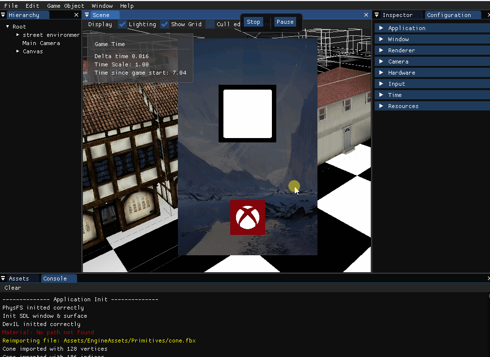
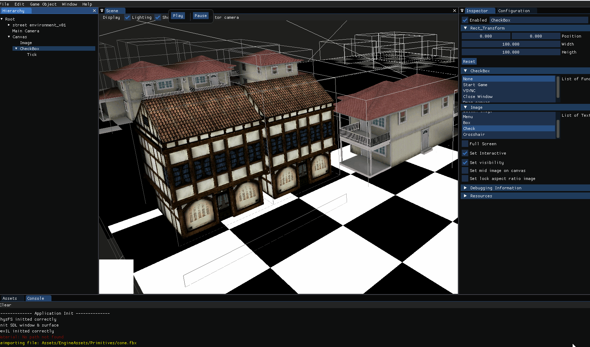
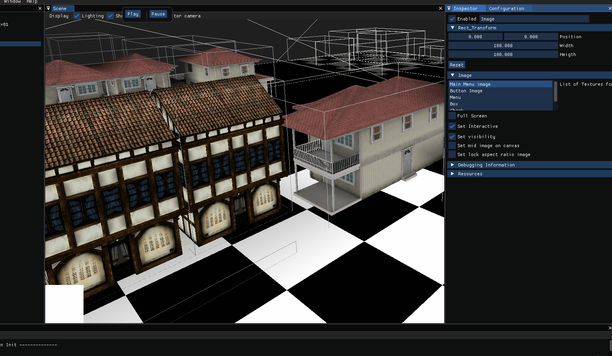
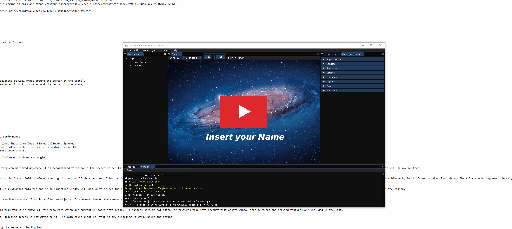
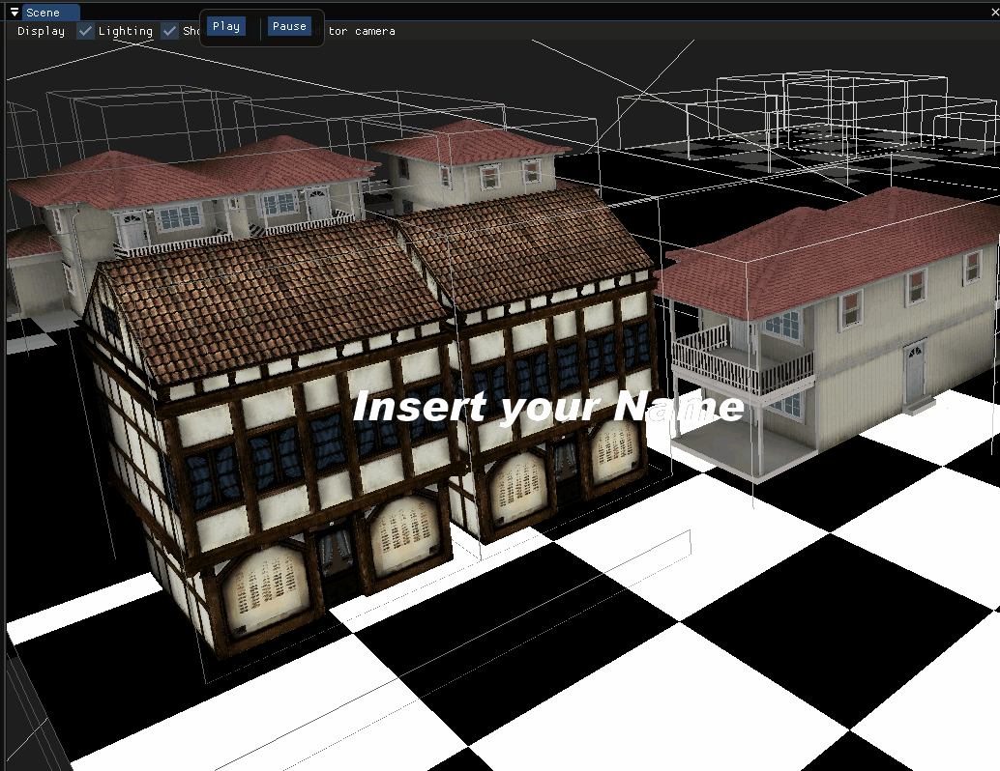

#### Welcome to Genesis Engine Forked Version for UI Sub System

This is my website about a 3D engine I've made for the University for the Videogame's engine assignment. This engine is not entirely made by me, props to Marc Pagès Francesh, link for his Github -> <a href="https://github.com/marcpages2020/GenesisEngine">Github</a>. I've focus on doing the UI sub-system.

To load the scene for this Assignment, when the engine is opened just go to file->load->scenes->main_menu.

Video of the Sub system working <a href="https://youtu.be/bkhq5X8IlhM">Video</a>.

### Team
 

Gerard Gil->Everything from here  <a href="https://github.com/Gerard346/GenesisEngine/commit/2a75ba8a97494f467f8d46a29975607bc5f8c864">Github</a>.
Marc Pagès Francesh -> Everything from before.

# UI Sub System
## Main core Sub Systems
- Function: Stores all the functions that our UI elements will use. The UI elemenents when clicked pass a function with the Function type that will call and himself.
- Font Importer: Used to load .ttf fonts and creates textures from the fonts.    Two main functions:   
    -Stores every characther from the font loaded so we can use it later to print the string.   
    -Prints the string itsel.   
- Module UI: Sets the render at Ortho and swaps again for prespective. When every gameobject that has no UI Element has been Update, we swap the render type and update every UI element. When it's finished we rever how it was.
- Fade: Fade used between screens. Just renders a Quad with opacity.
- UI Game Objects:
    - Button: 3 stats: Button On, Button Hover and Button Off, has a texture, and stores a function that will be called when clicked.
      
    - Canvas: Parent of all the UI elements. Has the ability to move inside the viewport.
      
    - Checkbox: Like the button, with one child, that will be enabled/disabled when clicked.
      
    
    
    - Image: Prints a texture in 2D.
      
    
    
    - RectTransform: Stores all the info about our UI elements; position, visibility, interactive, stay on mid,... When resizing if mid is enable it mantains the position.
     
     
    
    
    - Text: Stores the string that will be printed.
      
    
    
## Link to Release

<a href="https://github.com/Gerard346/GenesisEngine/releases/tag/v0.99">Release</a>   
<a href="https://github.com/Gerard346/GenesisEngine">Repository</a>

## License

MIT License
